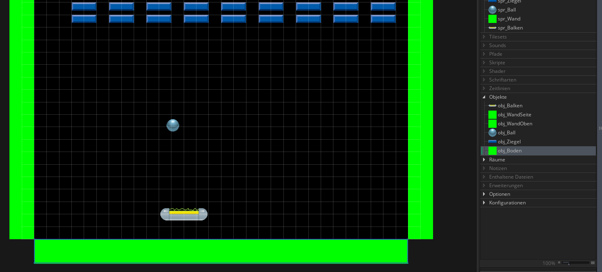
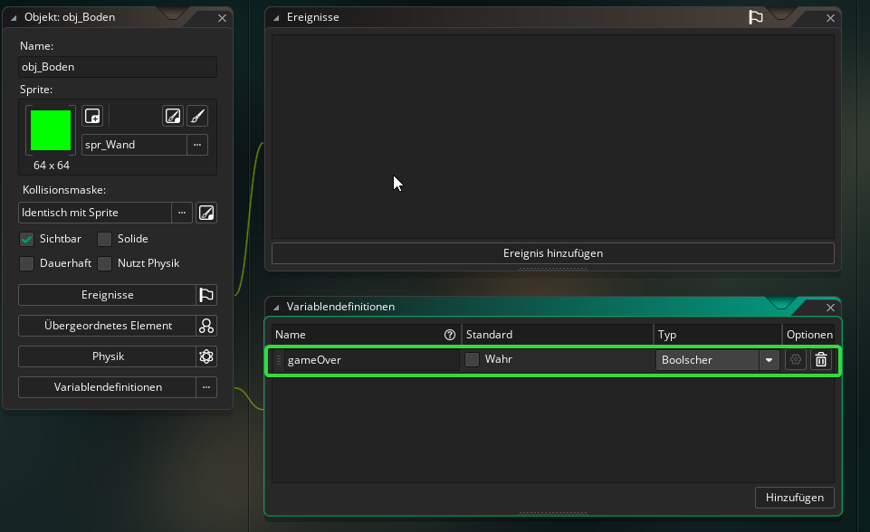
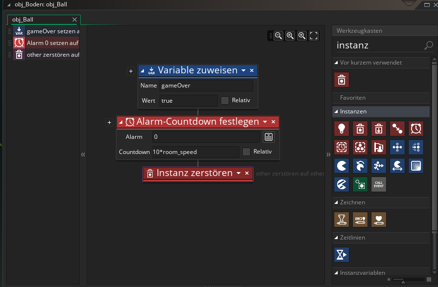
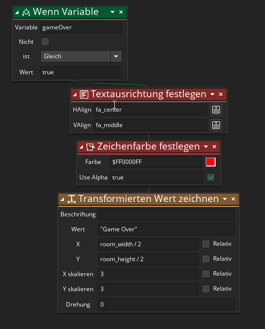
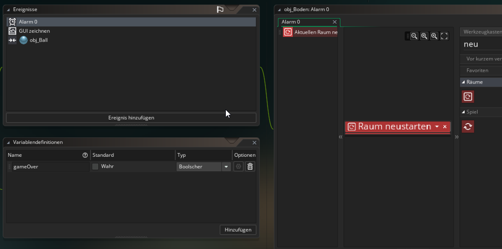

#7. Game Over
!!! Abstract "Ziele"
	In diesem Kapitel wirst du einen GameOver Text einfügen, wenn der Ball hinunter fällt und das Spiel anschließend neu starten.
	
---

Wenn der Ball hinunter fällt, soll das Spiel verloren sein, ein GameOver Text angezeigt werden und nach ein paar Sekunden soll das Spiel neu starten.

##7.1 Feststellen ob der Ball hinunterfällt

Eine einfache Möglichkeit festzustellen wenn der Ball hinunterfällt ist folgende:

Füge ein neues GameObject hinzu, nenne es *obj_Boden* und gib ihm das Sprite *spr_Wand*

Füge dann eine Instanz dieses Objekts außerhalb des Raums am unteren Spielfeldrand ein. (Es soll im Spiel nicht zu sehen sein)

Wenn der Ball nun mit diesem Objekt kollidiert, wissen wir, dass das Spiel verloren ist.

##7.2 Game Over

Erstelle im *obj_Boden* eine Variable vom Typ *Bool* und nenne sie *gameOver*. Diese Variable soll zu Beginn *false* sein.

Erstelle dann ein Kollisionsereignis mit *obj_Ball* in dem folgende Dinge passieren sollen:

1. *gameOver* auf *true* setzen
2. Einen Alarm-Countdown starten, der festlegt nach wie vielen Frames das Spiel neu gestartet werden soll.
3. Die Instanz des Balls zerstören (Bedenke hier, dass der Ball und nicht de Boden zerstört werden soll)
	
Dein Code sollte in etwa so aussehen:

!!!Tip "Alarme"
	Ein Alarm in Gamemaker ist ein Timer, den man setzen kann. Es gibt zwölf verschiedene Alarme (Nummeriert von 0 bis 11)  
	Wenn man einen Alarm setzt zb. *Alarm[0] auf 10\*room_speed* Dann wird nach 10 Sekunden das Ereignis *Alarm 0* ausgelöst.
	(*room_speed* ist die Anzahl an Frames pro Sekunde)
	

###7.2.1 GameOver Text anzeigen

!!Tip "Hinweis"
	Wenn man in Gamemaker irgendetwas auf den Bildschirm malen möchte (z.B. einen Text anzeigen), dann muss man dies immer in einem *Zeichnen*-Ereignis machen!
	
Erstelle im *obj_Boden* ein *GUI zeichnen* Ereignis.  
Überprüfe mit *Wenn Variable* ob *gameOver* *true* ist. Falls ja, dann zeichne mit dem Block *Transformierten Wert Zeichnen* den Text "Game Over" in die Bildschirmmitte.  
(Mit den Blöcken *Textausrichtung festlegen* und *Zeichenfarbe festlegen* kannst du weitere Einstellungen vornehmen)

###7.2.2 Spiel neu starten

Wenn der *Alarm 0* ausgelöst wird (Dieser wurde in 7.2 gestellt) soll das Spiel neu gestartet werden.

Erstelle ein Ereignis *Alarm 0* in *obj_Boden* und füge den Block *Raum neu starten* ein.

Teste!