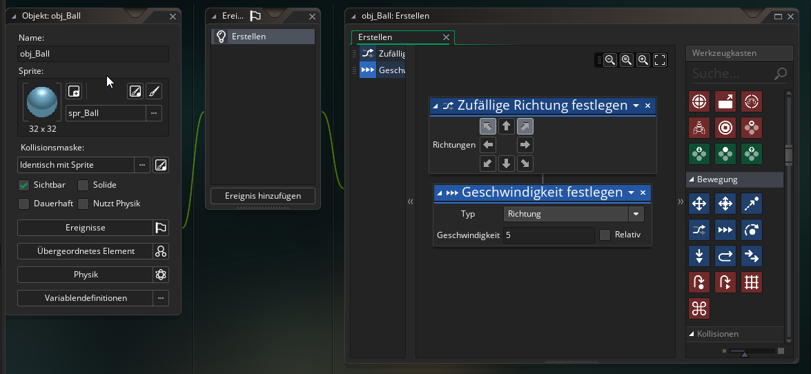
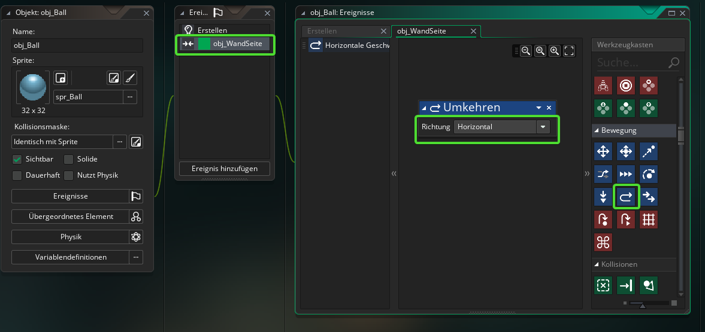
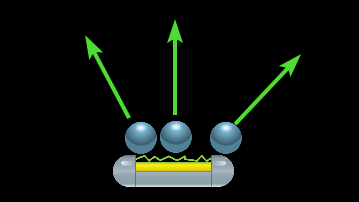
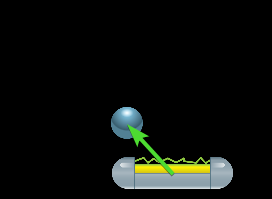
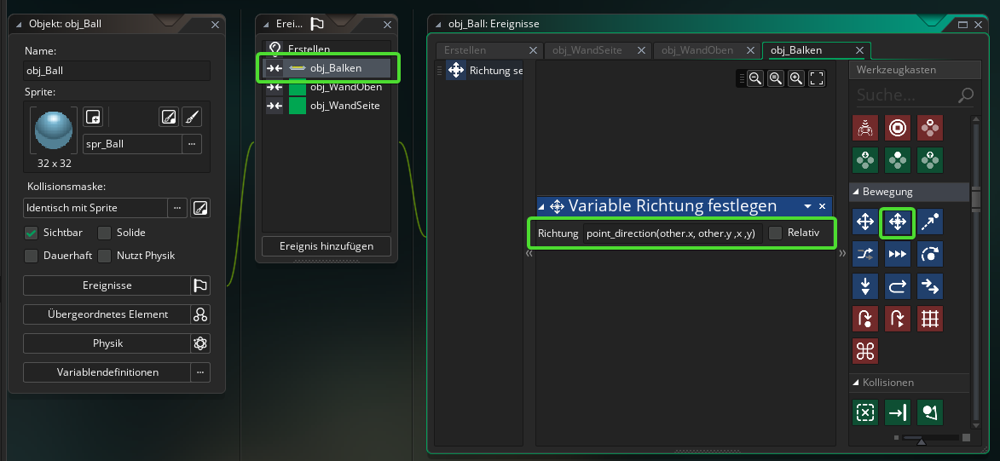

#6. Der Ball 

!!! Abstract "Ziele"
	In diesem Kapitel wirst das Objekt für den Ball erstellen und ihn so programmieren, dass er von den Wänden und dem Balken abprallt.
	
---

## 6.1 Objekt erstellen

Erstelle ein neues Objekt mit dem Namen "obj_Ball" und gib ihm das Sprite für den Ball. Füge eine Instanz von Ball in den *room0* ein.

---

## 6.2 Bewegung starten

!!! Tip "Ziel"
	Der Ball soll sich zu Beginn des Spiels schräg nach rechts oder links oben bewegen.

Füge dafür ein neues Ereignis "Erstellen" hinzu. (Dieses Ereignis wird ausgeführt, wenn die Instanz des Objekts erstellt wird)

Suche unter *Bewegung* den Befehl **Zufällige Richtung festlegen** und füge ihn ein. Du kannst nun einstellen, welche Richtungen zugelassen sind. Wähle die Richtungen *Oben-Links* und *Oben-Rechts* aus.

Füge danach den Befehl **Geschwindigkeit festlegen** ein und gibt bei *Typ* *Richtung* ein und stelle die Geschwindigkeit auf einen Wert zwischen 5 und 10 (Je schneller, desto schwieriger wird das Spiel)

Das Ereignis sollte nun in etwa so aussehen:

---

## 6.3 Kollision mit den Wänden

**Seitenwände**

!!! Tip "Ziel"
	Wenn der Ball eine der Wände berührt, so soll er abprallen. Dies funktioniert folgendermaßen:
	Wenn der Ball eine Seitenwand berührt, so muss die Richtung einfach nur in horizontaler (seitlicher) Richtung umgekehrt werden.

Hierfür gibt es unter *Bewegung* praktischerweise den Befehl *Umkehren* und das Ganze soll immer dann passieren, wenn der Ball mit einer Seitenwand kollidiert.

Füge dem Ball also ein neues Ereignis vom Typ **Kollision** mit *obj_WandSeite* hinzu. Suche unter Bewegung den Befehl *Umkehren* und füge ihn dem Ereignis hinzu und wähle bei *Horizontal* aus.

Das sollte nun folgendermaßen aussehen:

**Wand Oben**

Für die obere Wand funktioniert die Kollision genau gleich, nur dass diesmal die Richtung nicht Horizontal umgekehrt wird, sondern Vertikal (also von Oben nach Unten)

Erstelle dafür ein neues Kollisionsereignis mit *obj_WandOben* und füge den Befehl *Umkehren* mit Richtung: *Vertikal* ein.

Teste nun dein Programm und der Ball sollte von den Wänden abprallen. Allerdings fällt er nach wie vor durch den Balken durch.

---

## 6.4 Kollision mit dem Balken

Die Kollision mit dem Balken funktioniert etwas anders:

!!! Tip "Ziel"
	Je nachdem wo der Ball am Balken aufkommt, soll er in eine andere Richtung abprallen. (Das entspricht zwar nicht wirklich allen Regeln der Physik, macht spieltechnisch aber mehr Spaß)
	Der Winkel in dem der Ball vom Balken abprallt, soll also nicht von der Richtung des Balls davor abhängen, sondern nur von der Position vo der Ball mit dem Balken kollidiert.  
	

Erstelle ein neues Ereignis *Kollision mit obj_Balken* und füge den Befehl **Variable Richtung festlegen** ein. Um die neue Richtung des Balls zu bestimmen wollen wir einfach die Richtung vom Mittelpunkt des Balkens zum Mittelpunkt des Balls verwenden.  

Zur Berechnung dieser Richtung können wir die Funktion *point_direction(x1,y1,x2,y2)* verwenden. Diese Funktion berechnet die Richtung von einem Punkt *(x1,y1)* zu einem anderen Punkt *(x2,y2)*

!!!Tip "Position eines Objekts in Gamemaker"
	Die Position eines Objekts in Gamemaker wird in den Variablen **x** und **y** gespeichert. Das Schlüsselword **other** in einem Kollisionsevent ist immer eine Referenz auf das Objekt mit dem die Kollision stattfindet.  
	Also:  
	**x** und **y** sind also die Koordinaten des Objekts, von dem aus das Ereignis ausgeführt wird. 
	**other.x** und **other.y** sind die Koordinaten des Objekts mit dem die Kollision stattfindet.
	
Um nun die neue Richtung zu bestimmen füge den Befehl "point_direction(other.x,other.y,x,y)" in den Befehl *Variable Richtung festlegen* ein.

Das sollte folgendermaßen aussehen:

Teste dein Spiel!