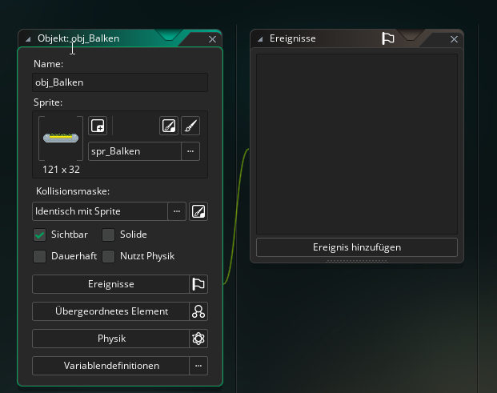
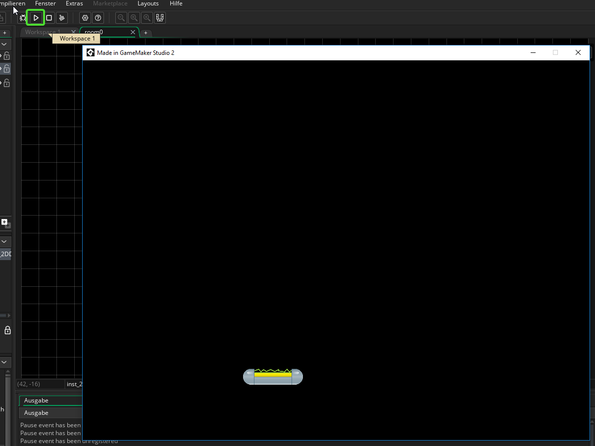
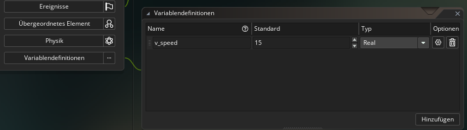
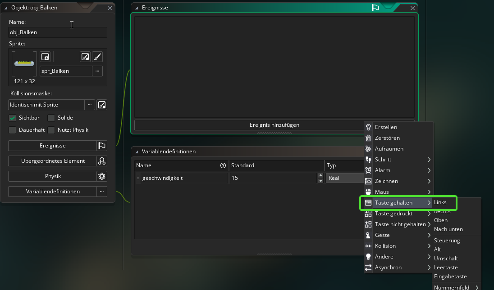
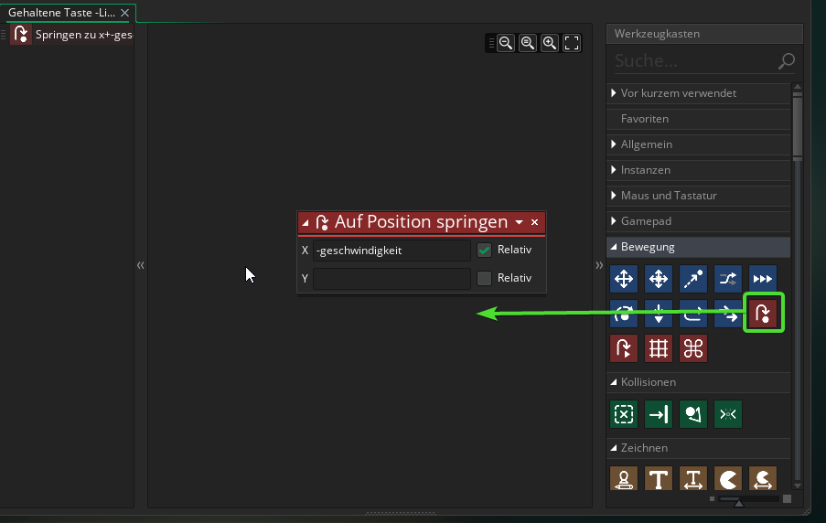

#4. Der Balken

!!! Abstract "Ziele"
	In diesem Kapitel wirst das Objekt für den Balken erstellen und programmieren.
	
---

##4.1. Objekt erstellen

Klicke mit der rechten Maustaste unter *Ressources* auf **Objekte** -> **Objekt erstellen**

Im Workspace siehst du nun das neu erstellte Objekt. Gib ihm den Namen "obj_Balken" und wähle das Sprite für den Balken aus.

Mache danach einen Doppelklick auf **room0** (unter Ressourcen->Räume) und füge das Objekt mit *Drag and Drop* in den Raum ein.

Du kannst das Spiel nun auch schon testen!

Zum Starten musst du einfach auf den "Play"-Button in der oberen Leiste drücken.

Allerdings tut sich in unserem Spiel ja noch gar nichts!

----

##4.2 Bewegung

Der Balken soll sich bewegen, wenn du auf die Pfeiltaste *links* bzw. *rechts* drückst.

Lege als Erstes eine Variable für die Bewegungsgeschwindigkeit an.
Gehe dafür im Workspace wieder zum *obj_Balken* und klicke auf **Variablendefinitionen**->**Hinzufügen** und erstelle eine Variable vom Typ *Real*, gib ihr den Namen "geschwindigkeit" und setze den Standardwert auf *15*.

!!!Tip "Ereignisse"
	Das Verhalten von Gamemaker Objekten wird über sogenannte Ereignisse geregelt. Ereignisse sind z.B. das Drücken einer Taste oder eine Kollision.

Klicke auf **Ereignis hinzufügen**->**Taste gehalten**->**links** um ein neues Ereignis hinzuzufügen.

Im Workspace siehst du nun ein neues Fenster für das gerade erstellte Ereignis. 

!!!Tip "Ansicht ändern im Workspace"
	Wenn du im Workspace die mittlere Maustaste gedrückt hältst kannst du die Ansicht verschieben. Mit *Strg* und Mausrad kannst du Zoomen.

In dem Ereignisfenster siehst du rechts viele Befehle. Diese können per Drag and Drop einfach zum Ereignis hinzugefügt werden. Suche unter dem Punkt *Bewegung* den Befehl *auf Position springen* und füge in ein. 
Gib dann bei *X* "-geschwindgkeit" ein und setze den Haken bei *Relativ*

Das heißt, wenn du die linke Pfeiltaste drückst hüpft das Objekt um so viele Pixel nach links (in negativer Richtung an der X-Achse), wie in der Variable *geschwindigkeit* festgelegt.

Wiederhole dies nun auch noch für die rechte Pfeiltaste, nur diesmal ohne das Minus vor *geschwindigkeit* damit sich das Objekt nach Rechts bewegt.

Teste das Programm (mit dem Play-Button in der oberen Leiste). Wenn du alles richtig gemacht hast, solltest du mit den Pfeiltasten den Balken nach rechts und links bewegen können.

