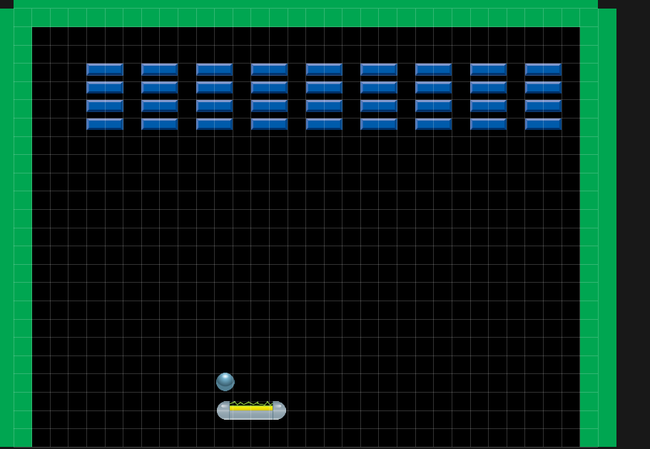
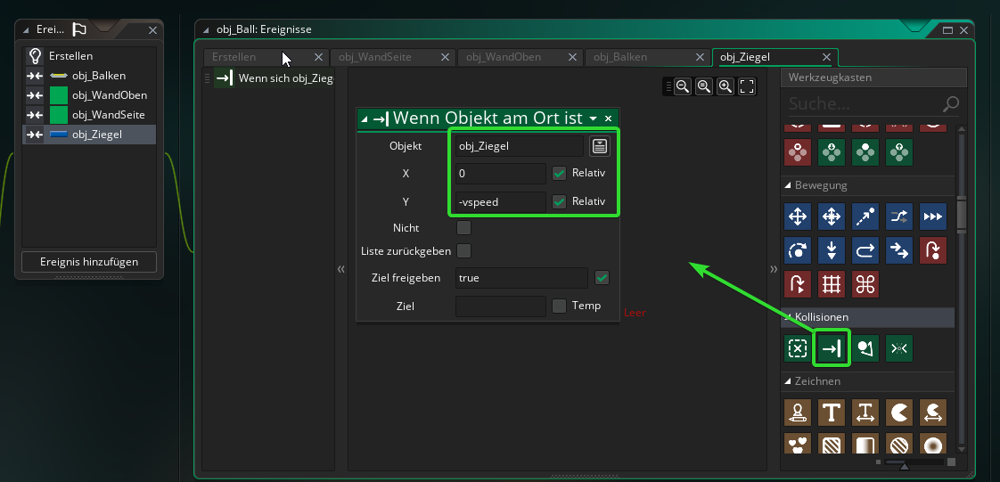

#7. Die Ziegel
!!! Abstract "Ziele"
	In diesem Kapitel wirst die Ziegel erstellen und die Kollisionen zwischen Ziegel und Ball programmieren.
	
---

Erstelle ein Objekt mit dem Namen "obj_Ziegel" und weise ihm das Sprite *spr_Ziegel* zu.

Füge dann einige Instanzen der Ziegel per Drag and Drop in den *room0* ein.

Es sollte in etwa so aussehen:

## 7.1 Kollision Ball und Ziegel

!!! Tip "Ziel"
	Wenn der Ball mit einem Ziegel kollidiert, sollen folgende Dinge passieren:  
	1. Der Ball soll abprallen, je nachdem von wo aus er auf einen Ziegel trifft  
	2. Der Ziegel soll entfernt werden
	

Die Kollision mit dem Ziegel programmieren wir wieder in einem Ereignis im *obj_Ball*

Gehe also im Workspace zu *obj_Ball* und füge ein Kollsisionsereignis mit *obj_Ziegel* ein.

Leider ist das Abprallen diesmal nicht so einfach, wie mit den Seitenwänden, denn wir müssen feststellen ob der Ball von Oben bzw. Unten oder von der Seite mit dem Ziegel kollidiert. Je nachdem welcher Fall auftritt ist, müssen wir dann einfach nur wieder die Richtung in horizontaler oder vertikaler Richtung umkehren. (wie in 6.3)

### Feststellen von welcher Seite der Ball kollidiert

!!!Tip "Die Variablen *hspeed* und *vspeed*"
	In *hspeed* wird die horizontale (also seitliche) Geschwindigkeit eines Objekts gespeichert. Das ist die Anzahl an Pixel, die sich ein Objekt in jedem Schritt (Step) der Gameloop nach rechts bzw. links bewegt.  
	In *vspeed* wird die vertikale (also oben/unten) Geschwindigkeit eines Objekts gespeichert.

!!!Tip "Kollisionshandling in Gamemaker"
	Das Kollisionsereignis in Gamemaker wird aufgerufen, wenn sich die Kollisionsmasken zweier Objekte bereits überlappen. (Nicht kurz davor!)
	
Zum Zeitpunkt an dem eine Kollision auftritt, liegt der Ball bereits über dem Ziegel. Um festzustellen ob der Ball den Ziegel von der Seite oder von unten/oben trifft gehen wir folgendermaßen vor:

1. Eine Kollision tritt auf.  

2. Wir überprüfen, ob eine Kollision stattfindet, wenn wir den Ball um *-vspeed*-Pixel vertikal verschieben. Ist das der Fall muss die Kollision von der Seite entstanden sein. Wir müssen die Richtung des Balls in horizontaler Richtung umkehren. 
3. Ist die Bedingung in 2. nicht erfüllt überprüfen wir, ob der Ball immer noch kollidiert, wenn wir ihn um *-hspeed* Pixel in seitlicher Richtung verschieben. Wenn dann noch immer eine Kollision stattfindet, muss die Kollision von oben oder unten entstanden sein und wir müssen die Richtung vertikal umkehren.
4. Zum Schluss muss man nur noch die Instanz des Ziegels zerstören

**Diesen Algorithmus implementieren wir nun:**

Suche in dem Kollisionsereignis zuerst nach *Wenn Objekt am Ort ist* unter Kollisionen. Gib als Objekt *obj_Ziegel* an und bei Y "-vspeed". Setze außerdem die beiden Häkchen bei *Relativ*  
Diese Bedingung überprüft nun, ob eine Kollision mit einer Instanz von *obj_Ziegel* entstehen würde, wenn der Ball an der Position (x,y-vspeed) wäre.

Füge den Block *Umkehren* rechts (!) an den *Wenn Objekt am Ort ist* Block an und stelle die Richtung auf *Horizontal*

!!!Warning "Achtung"
	Wenn du den Block nicht von Rechts anhängst und das Ganze bei dir so aussieht:  
	  
	Dann wird die Geschwindigkeit immer umgekehrt und nicht nur, wenn die Bedingung im Block darüber erfüllt ist.

Implementiere nun Punkt 3. aus dem oberen Algorithmus.
Zuerst benötigst du den *Else*-Block. Füge diesen hinten an den *Wenn Objekt am Ort ist* an.  
Hänge an den *Else*-Block von rechts einen *Wenn Objekt am Ort ist* Block an, mache die nötigen Einstellungen und kehre die Geschwindigkeit in vertikal um, wenn die Bedingung zutrifft.

!!!Tip "Hinweis"
	Der *Else*-Block wird in Gamemaker fälschlicherweise mit *Dann* übersetzt. Eine korrekte Übersetzung wäre *Sonst*
	
Im Letzten Schritt muss nun der Ziegel zerstört werden. Verwende dafür den Block *Instanz zerstören* und hänge ihn so an, dass die Instanz zum Schluss zerstört wird. Wichtig ist, dass du bei *Instanz zerstören* bei *Anzuwenden auf* **andere** auswählst, sonst wird der Ball zerstört.

Teste das Spiel!
