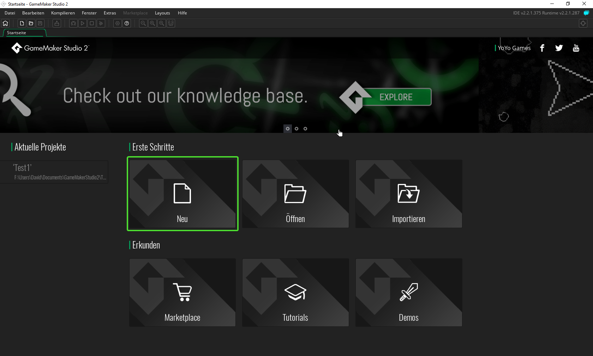
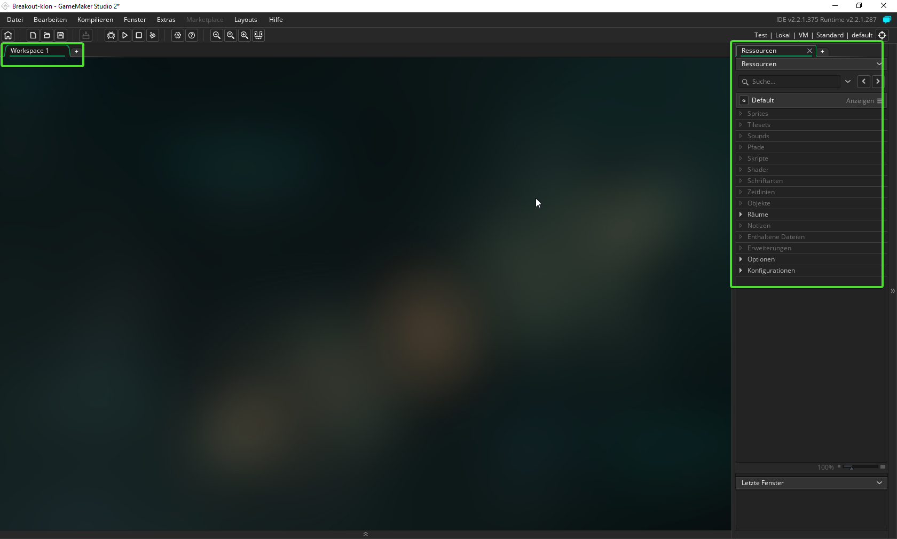

#2. Erste Schritte

!!! Abstract "Ziele"
	In diesem Kapitel wirst du ein neues Projekt anlegen und die wichtigsten Elemente der Bedienoberfläche kennenlernen

---

##Neues Projekt anlegen

Wenn du Gamemaker zum ersten Mal startest, kommst du auf die *Startseite*.

Klicke hier auf Neu, um ein neues Projekt anzulegen und wähle *Drag und Drop*

Anschließend wirst du gefragt, wo dein neues Projekt gespeichert werden soll. Wähle einen sinnvollen Speicherort aus und gib dem Projekt den Namen *Brickout*

---

##Bedienoberfläche 

Die beiden wichtigsten Punkte in der Bedienoberfläche sind der *Workspace* und die *Ressourcen*

---

##Ressourcen

Unter Ressourcen kannst du alle im Spiel verwendeten Resourcen verwalten.

Die wichtigsten Ressourcen für unser Projekt sind:

* Sprites 

* Objekte 

* Räume

---

## Objekte

Alle Dinge die in einem Gamemaker-Spiel etwas tun sind Objekte. Für unser Spiel benötigen wir zum Beispiel Objekte für den Ball, den Balken und die Ziegel.

###Objekt vs. Instanz
Wenn man in Gamemaker ein Objekt erstellt, wird noch nichts ins Spiel eingefügt. Man erstellt nur eine Vorlage die das Verhalten und die Eigenschaften eines Objekts festlegen. Später kann man einfach eine *Instanz* dieses Objekts in das Spiel einfügen.

!!!tip "Zum Beispiel:"
	Für unser Spiel benötigst du viele Ziegel, die man mit dem Ball zerschießen kann. Du musst hierfür nur ein Objekt *Ziegel* erstellen. Von diesem Objekt kannst du dann ganz viele Instanzen ins Spiel einfügen.

---

## Sprites

Sprites sind die Grafiken die für die Spielobjekte verwendet werden.

---

## Räume

In Räumen werden die Instanzen von Objekten eingefügt. Man kann sich die Räume auch wie einzelne Spiellevels vorstellen. Jedes Spiel benötigt mindestens einen Raum. (Deshalb wurde auch schon beim Erstellen des Projekts automatisch der Raum *room0* erstellt)