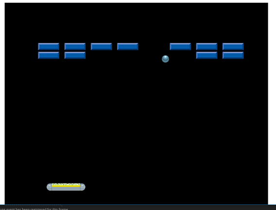

# Willkommen beim GameMaker Tutorial für Brickout - Ein Breakout Klon

## Über dieses Tutorial

In diesem Tutorial wird erklärt, wie man ganz einfach mithilfe von GameMaker Studio 2 ein eigenes Computerspiel erstellen kann.  
Das Tutorial richtet sich an Anfänger_innen ohne jegliche Programmiererfahrung und wurde insbesondere für den Einsatz im Informatikunterricht konzipiert.
Das gesamte Tutorial ist jedoch selbsterklärend und kann somit auch ohne Anleitung einer Lehrperson durchgeführt werden.

## Das Spiel

Das Spiel das in diesem Tutorial erstellt wird, ist ein ganz Simpler Klon des Klassikers Breakout.

##Lizenz

Das gesamte Porjekt steht unter der [Creative Commons CC0 Lizenz](https://creativecommons.org/publicdomain/zero/1.0/)

