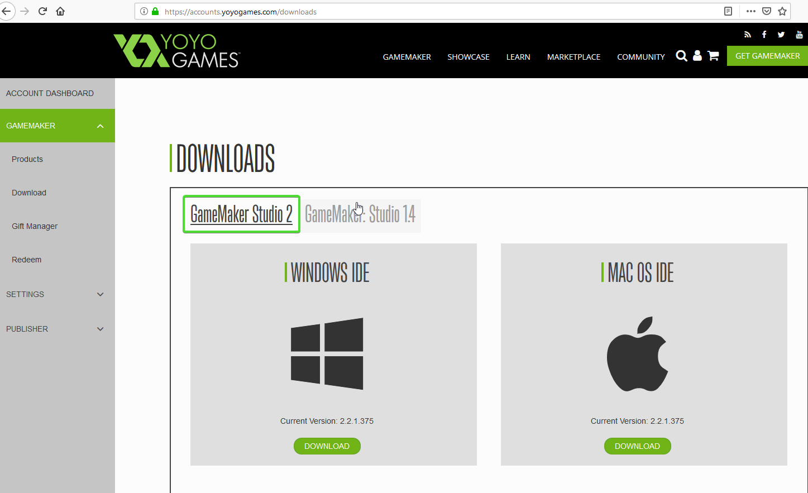

#Download und Installation

!!!tip "Hinweis"
     Wenn du Gamemaker Studio 2 bereits auf deinem Computer installiert hast, kannst du dieses Kapitel einfach überspringen.

---

## Registrierung

Um Gamemaker herunterladen zu können, benötigt man einen Yoyogames Account. Gehe auf die [Yoyogames-Website](https://accounts.yoyogames.com/login) und erstelle einen Account.

## Download von Gamemaker Studio 2

Gehe auf der Website auf [Get Gamemaker](https://www.yoyogames.com/get), klicke auf die Free Trial Version und wähle Gamemaker Studio 2, sowie Windows oder Mac (Je nachdem welches Betriebssystem du verwendest).

## Installation

Wenn der Download des Installationsprogramms fertig ist, starte dieses und installiere GamemakerStudio 2.