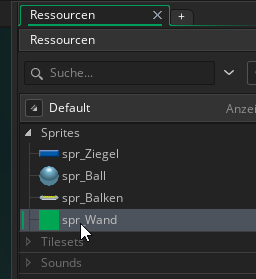

#3. Importieren der Sprites

!!! Abstract "Ziele"
	In diesem Kapitel wirst die Grafiken für dein Spiel herunterladen und in das Spiel importieren.
	
---

Für das Spiel benötigen wir 2D-Grafiken die wir als Sprites in unser Spiel einbauen.

[https://www.opengameart.org](https://www.opengameart.org) ist eine großartige Quelle für GameAssets(Sprites, Sounds, 3D-Modelle, etc.) die du für deine Games verwenden kannst.

!!! Warning "Achtung"
	Die auf OpengameArts zur Verfügung gestellten Assets unterliegen selbstverständlich trotzdem einem Copyright. Du musst immer sicher stellen, dass du die Copyrightbedingungen nicht verletzt, wenn du Assets aus dem Internet herunterlädst. 
	
---

Für unseren Breakout-Klon verwenden wir [Breakout (Brick Breaker) Tile Set - Free](https://opengameart.org/content/breakout-brick-breaker-tile-set-free)

Wenn du auf den Link klickst siehst du, dass diese Grafiken unter der **CC0**-Lizenz stehen. Das bedeutet, du kannst die Assets für eigene Projekte (sogar kommerziell) verwenden, verändern, weitergeben darfst. Mehr Infos dazu [hier](https://creativecommons.org/publicdomain/zero/1.0/)

## Importieren der Sprites in Gamemaker

Lade dir das Paket von [hier](https://opengameart.org/content/breakout-brick-breaker-tile-set-free) runter und entpacke es in einen geeigneten Ordner.

### 3.1 Ziegel

Gehe wieder zurück in Gamemaker. Klicke unter **Ressourcen** mit der rechten Maustaste auf **Sprites** und dann auf **Sprite aus Bild(ern) erstellen**

Gehe dann im entpackten Verzeichnis in den Unterordner "Breakout Tile Set Free\PNG" und öffne **01-Breakout-Tiles.png**

Nun siehst du im Workspace die Einstellungen des gerade importierten Sprites.

Benenne das Sprite um in "spr_Ziegel" und ändere die Größe des Bildes über Bild skalieren auf 64x21 Pixel.

Wichtig ist auch, dass bei Kollisionsmaske *automatisch* und *Rechteck* eingestellt ist.

!!! Tip "Kollisionsmaske"
	Eine Kollision zweier Objekte findet immer dann statt, wenn sich die Kollisionsmasken der Sprites dieser Objekte überlappen. Das ist wichtig um z.B. festzustellen wann die Kugel den Ziegel berührt. Es ist wichtig immer möglichst einfache Formen für die Kollisionsmaske zu verwenden, da die Berechnungen zur Kollisionserkennung für komplexe Figuren sehr aufwändig sind und zu Lags (Ruckeln) im Spiel führen kann.
	

### 3.2 Ball

Importiere wie in 3.1 das Sprite für den Ball. Verwende hierfür die Datei **58-Breakout-Tiles.png** und benenne das Sprite "spr_Ball"

Ändere die Skalierung auf 32x32 Pixel und stelle die Kollisionsmaske auf "Ellipse"

Stelle außerdem die Koordinaten des Ursprungs des Sprites auf "Mitte mittig"

### 3.3 Balken

Importiere nun das Sprite für den Balken. Verwende die Datei **50-Breakout-Tiles.png**, benenne es "spr_Balken", stelle die Skalierung auf 121x32 Pixel und die Kollisionsmaske auf "Präzise"

Stelle außerdem die Koordinaten des Ursprungs des Sprites auf "Mitte mittig"

!!!Tip "Hinweis"
	Dass diese Kollisionsmasken ein bisschen langsamer sind, ist nicht so schlimm, da in dem Spiel nur ein Balken und ein Ball vorkommen. (Für Objekte von denen es viele Instanzen gibt, sollte man Fall die Kollisionsmaske "Präzse" nicht verwenden)

### 3.4 Wand

Zuletzt erstellen wir noch ein einfärbiges Sprite für die Wände oben und an den Seiten. Klicke dafür wieder mit der rechten Maustaste auf **Sprites** und dann auf **Sprite erstellen**

Mach dann einen Doppelklick auf das leere Bild des Sprites (Siehe Screenshot unten) und fülle das Bild einfach mit einer Farbe deiner Wahl. Gib dem Sprite anschließend noch den Namen "spr_Wand"

----

Du solltest nun die vier Sprites für Ziegel, Ball, Balken und Wand in deinem Projekt haben.

