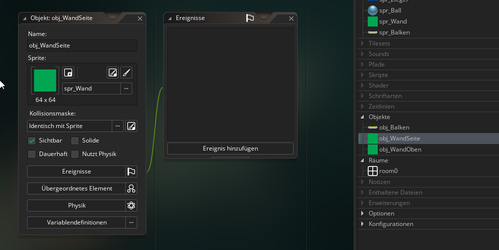
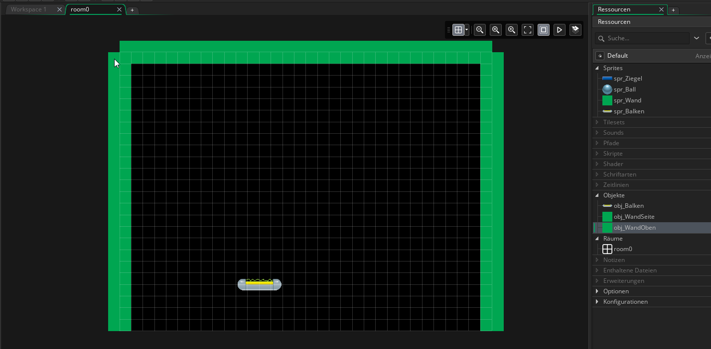

#5. Die Seitenwände

!!! Abstract "Ziele"
	In diesem Kapitel wirst die Seitenwände erstellen, die verhindern, dass der Ball aus dem Spielfeld fliegt.
	
---

Erstelle zwei neue Objekte mit den Namen "obj_WandSeite" und "obj_WandOben" und gib beiden Objekten das Sprite "spr_Wand"

Gehe wieder in *room0* und füge am oberen Rand eine Instanz von *obj_WandOben* ein und ziehe sie mit der Maus so groß, dass sie über die ganze Breite des Raums geht.

Füge dann links und rechts je eine Instanz von *obj_WandSeite* ein und ziehe sie so groß, dass sie die ganze Höhe des Raums abdecken.

Der Raum sollte nun in etwa so aussehen:

